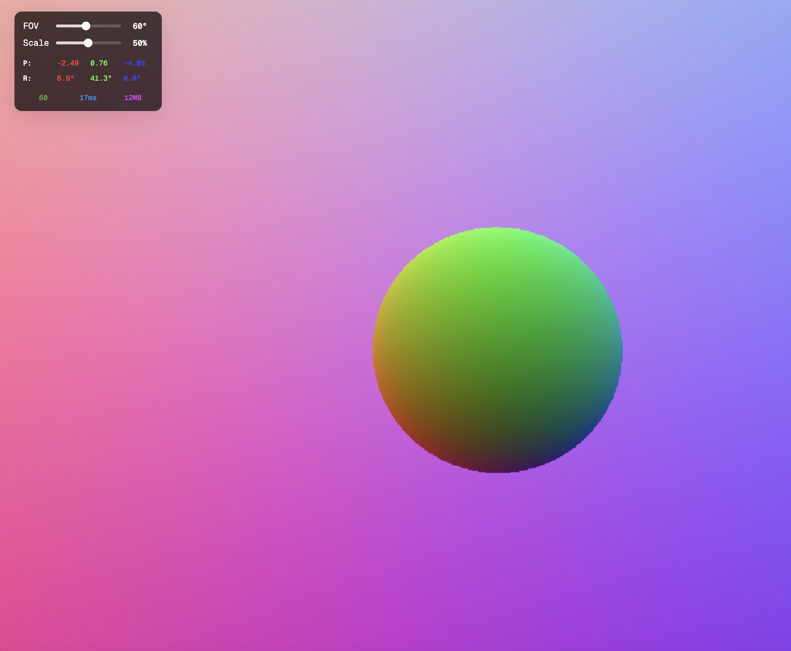

Live at https://aparimeya-art.csgpxmv65k.workers.dev/

# Experimental Ray Tracer

An experimental ray tracer built with WebGPU, exploring real-time rendering techniques. Might make it a package / standalone thing that is helpful to get started with WebGPU but will definitely be using this for my personal website.

<!-- Add screenshot here -->



## Controls

- **W/A/S/D** - Move forward/left/backward/right
- **Q/E** - Move down/up
- **Mouse drag** - Pan camera view
- **R** - Reset camera position

## Getting Started

To run the ray tracer locally:

```bash
# Install dependencies
npm install

# Start development server
npm run dev

# Open in browser
npm run dev -- --open
```

## Building

To create a production version:

```bash
npm run build
```

Preview the production build:

```bash
npm run preview
```

## Technology Stack

- **WebGPU** - Modern graphics API for high-performance rendering
- **SvelteKit** - Web framework for the user interface
- **TypeScript** - Type-safe development
