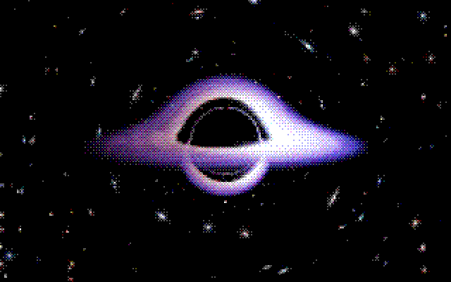

# Direct WebGPU migration

The rendering backend now uses the browser’s WebGPU API directly. Three.js, its types and transitive helpers, and every GLSL shader have been removed. TypeScript owns the device, textures, pipelines, bindings, and command submission. Svelte still owns the interface. `@webgpu/types` is a development-only type package.

The light-path integrator, sampling counts, disk/sky formulas, bloom kernels, tone mapping, ASCII glyphs, dithering, gradients, camera behavior, and defaults were retained. This is a backend migration, not a different black-hole model. Unsupported browsers show a WebGPU requirement; there is no fallback renderer.

## Performance

Measured on an Apple M2 (10 GPU cores), macOS, Chromium 152 in the Codex in-app browser. Output was fixed at 1280×720 CSS pixels. The table reports medians of three trials, each with 30 warm-up frames and 120 measured animation-frame intervals. CPU time measures render submission, not GPU execution.

| Case | Before: Three.js/WebGL | After: direct WebGPU |
| --- | ---: | ---: |
| Default frame rate | 60.0 FPS | 60.0 FPS |
| Default frame interval | 16.67 ms | 16.67 ms |
| Default CPU submission | 0.20 ms | 0.21 ms |
| Maximum frame rate | 18.4 FPS | 15.1 FPS |
| Maximum frame interval | 54.45 ms | 66.25 ms |
| Maximum p95 frame interval | 66.7 ms | 83.4 ms |
| Maximum CPU submission | 0.30 ms | 0.23 ms |
| Default render-target storage | 13.07 MiB | 13.07 MiB |
| Maximum render-target storage | 62.40 MiB | 62.40 MiB |

Default settings reached the browser’s 60 Hz ceiling in both backends. **Maximum settings were about 18% slower after migration on this machine.** Earlier individual trials varied, so this is not a cross-device performance guarantee or a claim that WebGPU is inherently faster. No quality settings were lowered to improve the result.

“Default” is the unchanged 0.33× scene: a 422×237 trace target, dither 8, and six passes. “Maximum” uses a 2240×1260 trace target (1.75×), maximum disk/star/exposure/glow/time controls, gravity grid, dither 8, and Cosmic filtering: eight passes. Both use two rays per pixel and sixteen near the critical ring. ASCII and Dither are mutually exclusive; their other combinations were checked separately.

The memory estimate counts eight bytes per intermediate texel, excluding the canvas, driver allocations, and uniforms. WebGPU adds one eight-byte dummy texture for unused bindings. Texture counts differ because the previous backend allocated some resources lazily.

All production browser JavaScript fell from approximately **639 kB to 181 kB**, or **173 kB to 60 kB when individually gzipped**—about 65% less compressed JavaScript. These totals include the Svelte application, not just the renderer. [Bundle measurements](benchmarks/webgpu/bundle.json).

Raw trials: [before](benchmarks/webgpu/before-final.json), [after](benchmarks/webgpu/after-final.json). Their `initializationMs` values are not comparable: the old renderer compiled shaders lazily, while the new one awaits pipelines. The exploratory `completedFrameMs` field is also excluded: the legacy completion call did not provide a comparable GPU fence. Only animation-frame and CPU-submission timings support the table above. Runs were local, sequential, and not thermally controlled.

## Visual and behavior checks

139 matching configurations rendered without GPU validation errors. Forty-four were byte-identical. The largest mean absolute RGB difference was 0.196 on a 0–255 scale, in the smallest ASCII glyph case; differences concentrate at discrete glyph/quantization boundaries and thin features. This is close visual agreement, **not universal pixel identity**. [Per-case differences](benchmarks/webgpu/visual-comparison.json).

The larger default dither and custom-filter references matched pixel-for-pixel. Camera framing, disk and star positions, glow, and grid intersections remained aligned in the other reference views.

| Reference | Before | After |
| --- | --- | --- |
| Default |  |  |
| Maximum |  |  |

Twenty unit tests cover camera, sensor math, color conversion, resolution, and gradients. Browser lifecycle tests cover missing WebGPU, device loss, recreation, disposal, and tiny canvases. Physical phone sensors and other GPU/browser combinations still need device testing. See [verification](verification.md) for the repeatable checks.
